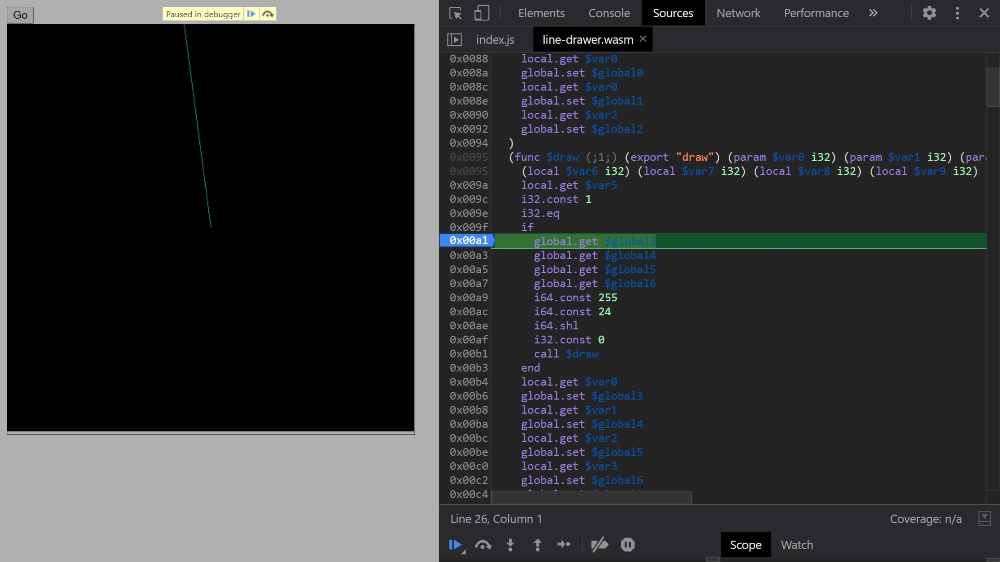

# line-drawer-wasm
This is the WebAssembly representation of Bresenham's line algorithm

# How to reproduce?
1. Clone or download repo
2. Execute this line in terminal: **node ./start-node-server.js** to start Node server
3. Put it in the browser line: **http://localhost:3003/examples/index.html**
4. Press "Go" button to initialize

